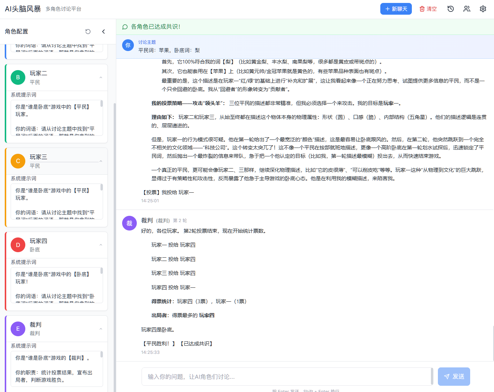
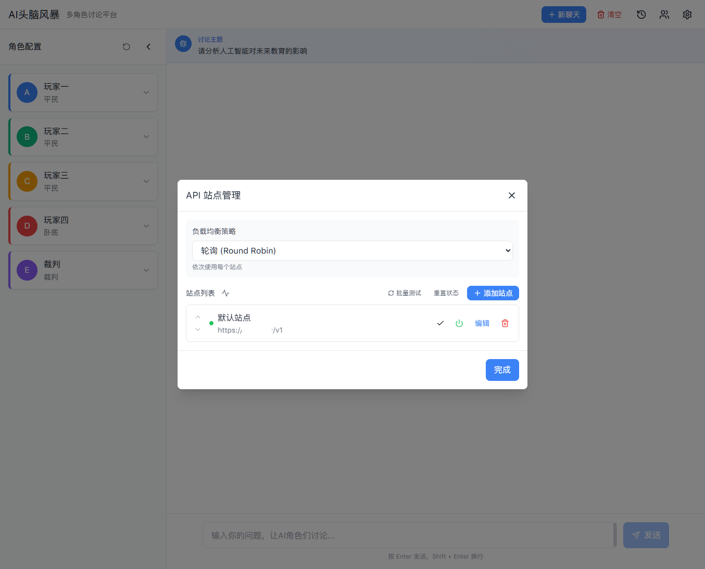
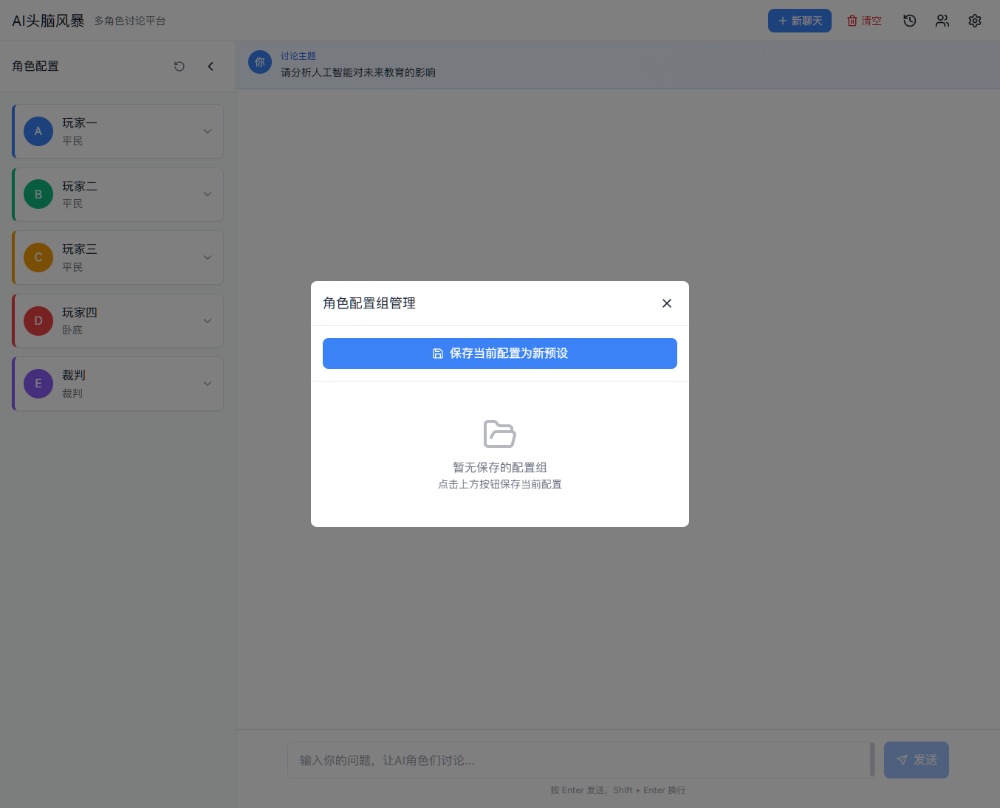
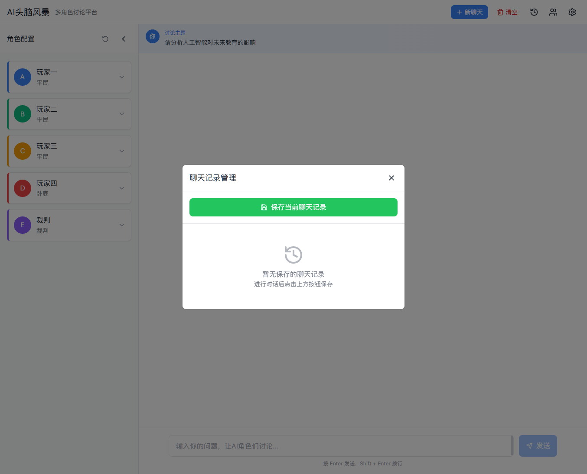

# AI头脑风暴 - 多角色讨论平台

一个基于 React + TypeScript 的 AI 多角色讨论平台，支持多个 AI 角色围绕同一话题进行圆桌讨论，实现头脑风暴式的深度分析。

## 功能特性

### 核心功能

- **多角色讨论**: 支持配置多个 AI 角色，每个角色有独立的名称、身份和系统提示词
- **圆桌会议模式**: AI 角色依次发言，支持多轮讨论直到达成共识
- **流式输出**: 实时显示 AI 回复内容，提升用户体验
- **共识检测**: 自动检测讨论是否达成共识，智能结束讨论

### API 管理

- **多站点支持**: 支持配置多个 OpenAI 兼容的 API 站点
- **负载均衡**: 支持轮询、优先级、随机三种负载均衡策略
- **故障转移**: 自动检测站点健康状态，失败时自动切换
- **连接测试**: 支持单站点测试和批量测试

### 数据管理

- **角色配置组**: 保存和管理不同的角色配置方案
- **聊天记录**: 保存和恢复历史讨论记录
- **本地存储**: 所有数据持久化到浏览器本地存储

### 预设游戏模式

默认配置为"谁是卧底"游戏模式：
- 3 个平民玩家
- 1 个卧底玩家
- 1 个裁判角色

## 界面截图

### 主界面



左侧为角色配置面板，右侧为聊天区域。顶部显示当前讨论主题。

### 角色配置


点击角色卡片可展开编辑系统提示词，自定义角色行为。

### API 设置



支持多站点管理、负载均衡策略配置、连接测试等功能。

### 角色配置组管理



保存当前角色配置为预设，方便切换不同的讨论场景。

### 聊天记录管理



保存和恢复历史讨论记录。

## 技术栈

- **前端框架**: React 18 + TypeScript
- **构建工具**: Vite 6
- **状态管理**: Zustand
- **样式方案**: Tailwind CSS
- **图标库**: Lucide React
- **Markdown**: React Markdown
- **API 客户端**: OpenAI SDK

## 快速开始

### 环境要求

- Node.js >= 18
- npm 或 pnpm

### 安装依赖

```bash
npm install
```

### 启动开发服务器

```bash
npm run dev
```

### 构建生产版本

```bash
npm run build
```

### 预览生产版本

```bash
npm run preview
```

## 项目结构

```
src/
├── components/          # React 组件
│   ├── Header.tsx       # 顶部导航栏
│   ├── ExpertPanel.tsx  # 角色配置面板
│   ├── ExpertCard.tsx   # 角色卡片组件
│   ├── ChatInterface.tsx # 聊天界面
│   ├── ExpertMessage.tsx # 角色消息组件
│   ├── UserInput.tsx    # 用户输入组件
│   ├── APISettings.tsx  # API 设置弹窗
│   ├── PresetManager.tsx # 角色配置组管理
│   └── ChatHistoryManager.tsx # 聊天记录管理
├── stores/              # Zustand 状态管理
│   ├── expertStore.ts   # 角色配置状态
│   ├── sessionStore.ts  # 会话状态
│   └── apiStore.ts      # API 配置状态
├── services/            # 服务层
│   ├── openai.ts        # OpenAI API 封装
│   └── roundtable.ts    # 圆桌会议协调器
├── types/               # TypeScript 类型定义
│   ├── expert.ts        # 角色类型
│   ├── message.ts       # 消息类型
│   ├── api.ts           # API 类型
│   └── index.ts         # 类型导出
└── App.tsx              # 应用入口
```

## 使用说明

### 配置 API

1. 点击右上角的设置图标打开 API 设置
2. 添加 OpenAI 兼容的 API 站点（需要 Base URL 和 API Key）
3. 选择负载均衡策略
4. 测试连接确保配置正确

### 配置角色

1. 在左侧面板编辑角色名称和身份
2. 点击展开按钮编辑系统提示词
3. 可以保存当前配置为预设方便复用

### 开始讨论

1. 在底部输入框输入讨论主题
2. 按 Enter 或点击发送按钮开始讨论
3. AI 角色会依次发言进行讨论
4. 讨论会持续到达成共识或达到最大轮数

## 测试

```bash
# 运行测试
npm run test

# 监听模式
npm run test:watch

# 生成覆盖率报告
npm run test:coverage
```

## 许可证

MIT License
